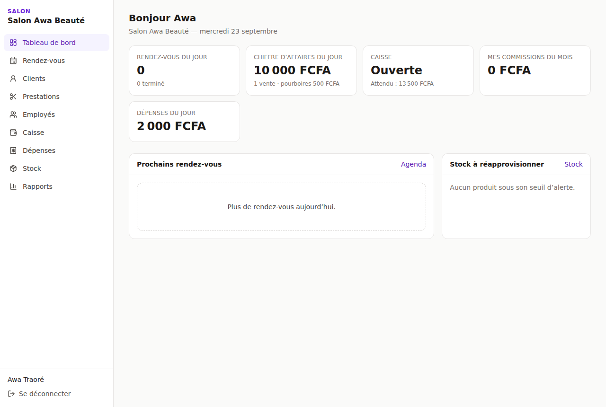
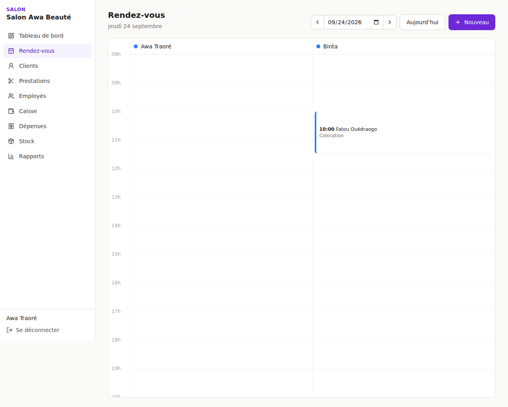
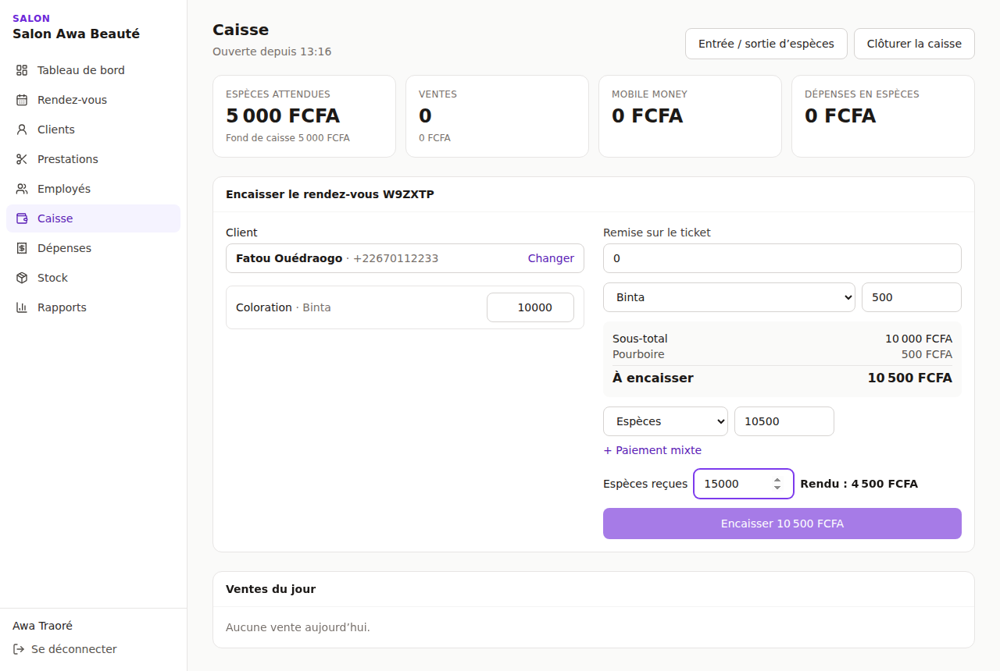
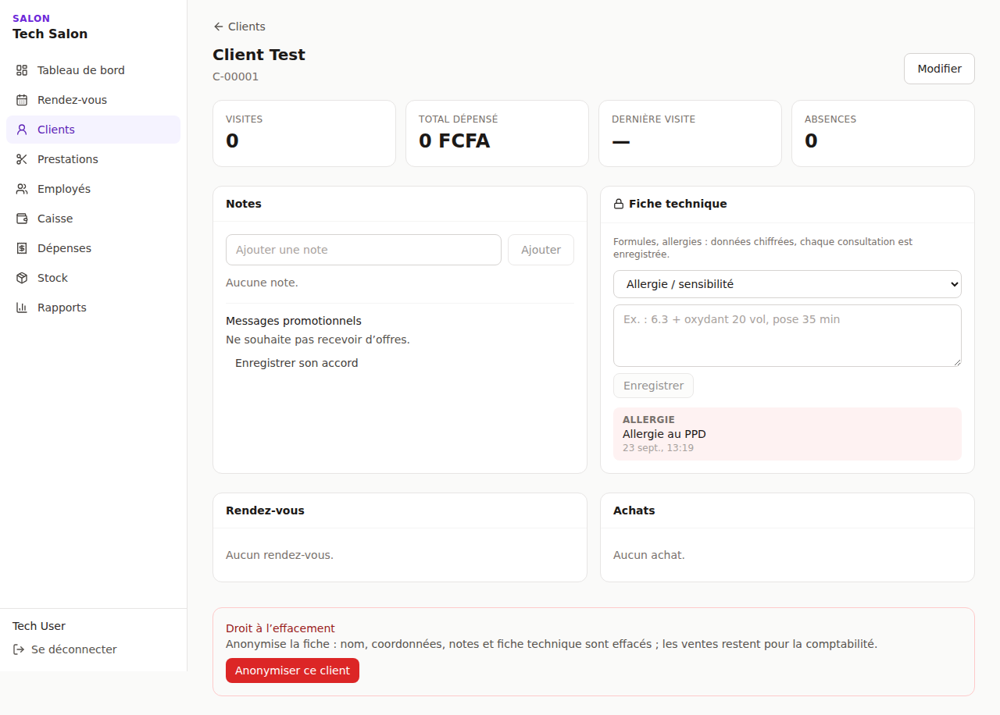
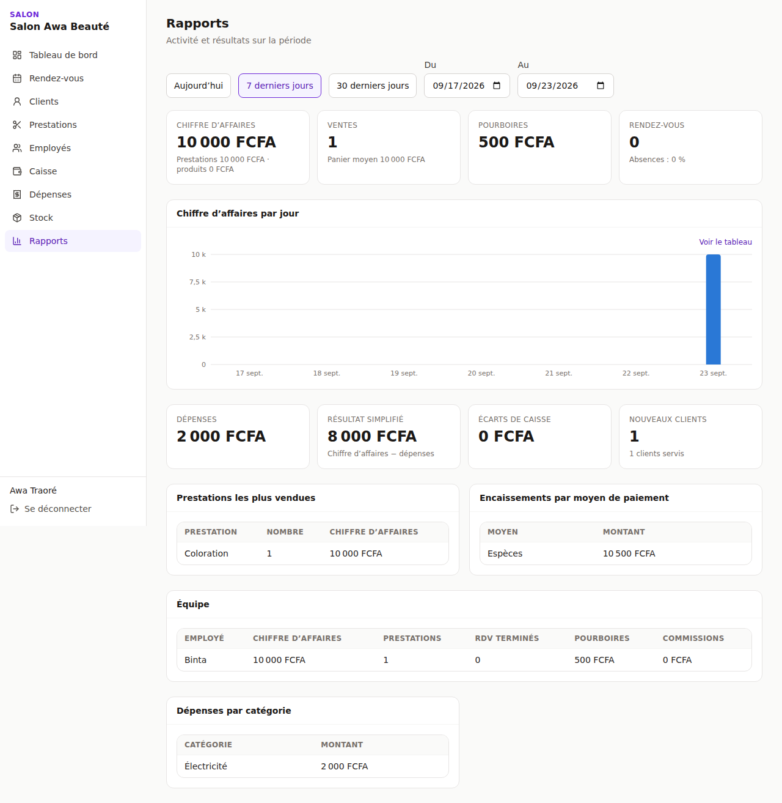
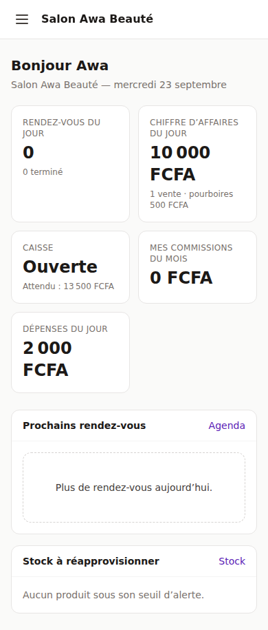

# Application du salon

> Code : `apps/api/src/modules/*` (API) et `apps/web` (application Next.js).
> Tests : 70 tests de bout en bout sur PostgreSQL (dont un parcours complet du salon et des attaques
> d'isolation), 18 tests unitaires. Un parcours complet a aussi été joué dans un vrai navigateur
> (Chromium, via Playwright) : inscription → employé → prestations → client → caisse → rendez-vous
> → encaissement → dépense → stock → rapports.

| Tableau de bord | Agenda | Caisse |
|---|---|---|
|  |  |  |

| Fiche client | Rapports | Mobile |
|---|---|---|
|  |  |  |

---

## 1. Démarrer

```bash
# API (voir docs/03 pour la base et les rôles PostgreSQL)
cd salons-saas/apps/api && npm install && npm run build
npm start                                  # http://localhost:3002/api/v1

# Application web
cd salons-saas/apps/web && npm install
API_URL=http://localhost:3002 npm run dev  # http://localhost:3000
```

L'application web relaie `/api/v1/*` vers l'API. Pour le navigateur, l'application et l'API ont donc la
même origine :
- le cookie de session reste propre au site (« first-party ») ;
- aucune configuration CORS n'est nécessaire ;
- le jeton d'accès reste en mémoire, jamais dans `localStorage`.

En production, Caddy peut router `/api` directement vers l'API. Dans ce cas, activer `TRUST_PROXY=true`
pour que la limitation de débit voie l'adresse réelle de chaque client.

---

## 2. Écrans et droits

Le menu n'affiche que les écrans permis par le rôle. L'API reste seule juge : masquer un bouton n'est
jamais une protection.

| Écran | Visible avec | Contenu |
|---|---|---|
| Tableau de bord | tout membre | Rendez-vous du jour, CA du jour, état de la caisse, Mobile Money à vérifier, stock bas, dépenses du jour, mes commissions. Chaque bloc n'apparaît qu'avec la permission correspondante |
| Rendez-vous | `appointments.read` ou `.own` | Planning du jour par employé, zones hors horaires grisées, prise de RDV à partir des vrais créneaux libres, arrivée / début / fin / absence / annulation, déplacement, « Encaisser ». Un coiffeur ne voit que sa colonne |
| Clients | `clients.read.basic` | Recherche (nom, n°, téléphone), création rapide, fiche : statistiques, notes, consentement marketing, **fiche technique chiffrée**, historique RDV et achats, anonymisation |
| Prestations | `services.read` | Catégories, prix (modifiables seulement avec `prices.manage`), durée, **étapes avec temps de pose**, variantes, employés qui les réalisent |
| Employés | `staff.read` | Employés avec ou sans compte, invitation (lien à envoyer par WhatsApp), planning hebdomadaire, absences, rôle, suspension, règles de commission |
| Caisse | `sales.create` / `cash.*` | Ouverture avec fond de caisse, ticket (rendez-vous ou vente directe), remise, pourboire, paiement mixte, rendu monnaie, Mobile Money à vérifier, ventes du jour et annulation, entrées / sorties d'espèces, clôture avec comptage |
| Dépenses | `expenses.create` / `.manage` | Saisie (espèces = sortie de caisse), filtre par période ; seul `expenses.manage` voit tout et supprime |
| Stock | `stock.read` (offre avec stock) | Produits, quantités par salon, réception (coût moyen), inventaire, perte, seuil d'alerte, historique |
| Rapports | `reports.*` | CA par jour (graphique + tableau), ventes, panier moyen, pourboires, prestations, équipe (CA, commissions), paiements ; avec `reports.finance.read` : dépenses, résultat, écarts de caisse. `reports.read.own` : ses propres chiffres uniquement |

---

## 3. Règles métier appliquées par l'API

### Rendez-vous
- **Créneaux proposés** = horaires du salon ∩ planning de l'employé − fermetures − absences − rendez-vous
  existants, par pas de `slotIntervalMinutes` (15 min par défaut).
- **Temps de pose.** Seules les étapes « bloquantes » occupent l'employé.
  - Exemple : une coloration à 10 h (application 30 min, pose 40 min, rinçage 20 min) laisse l'employé
    libre de 10 h 30 à 11 h 10. Une coupe de 40 min y tient ; des nattes de 60 min, non.
  - Ce cas est vérifié dans les tests de l'API et dans le navigateur.
- **Double réservation impossible**, même en cas de clics simultanés : la base refuse les chevauchements
  (contrainte d'exclusion PostgreSQL).
- **Hors horaires** : refusé, sauf « forçage » par un membre ayant `appointments.manage`.
- **Annulation ou absence** : le créneau est libéré immédiatement. Une absence incrémente le compteur
  d'absences du client.
- **Prix et durée figés** : le rendez-vous garde le prix du moment. Un tarif propre à un employé
  (prix, rythme) est pris en compte.

### Caisse
- **Caisse obligatoire pour les espèces** : un paiement en espèces exige une caisse ouverte dans ce salon.
- **Total exact** : la somme des paiements doit égaler le total, pourboires compris. Le rendu de monnaie
  est calculé par l'écran.
- **Remises** : il faut `sales.discount`. Sans `prices.manage`, la remise est plafonnée à 20 % du ticket
  (réglage `sales.max_discount_percent`).
- **Prix modifiables** : seulement pour une prestation « à partir de » (jamais en dessous du prix de base),
  ou avec `prices.manage`.
- **Mobile Money manuel** :
  - la référence de transaction est obligatoire et ne peut servir qu'une fois ;
  - sans `payments.validate`, la vente reste « à vérifier » jusqu'à la validation d'un responsable ;
  - un paiement « introuvable » annule la vente.
- **Vente payée** : dans la même transaction, l'API
  - inscrit la vente au registre en partie double ;
  - décrémente le stock (produits vendus et consommations prévues par prestation) ;
  - calcule les commissions (la règle la plus précise l'emporte) ;
  - met à jour la fiche client (visites, total dépensé) ;
  - passe le rendez-vous à « Terminé ».
- **Numéros** : chaque vente a un numéro continu par entreprise et par année (`V-2026-000001`).
- **Annulation** (`sales.void`, motif obligatoire) :
  - écritures inverses au registre, produits remis en stock, commissions négatives, remboursements
    tracés ;
  - refusée si la caisse de la vente est déjà clôturée.
- **Espèces attendues** : lues dans le registre (compte « espèces » de la session). Ventes, annulations,
  dépenses et mouvements y sont tous inscrits : aucun calcul parallèle ne peut diverger.
- **Clôture** : l'écart entre compté et attendu est inscrit au registre et doit être justifié.
  La clôture est refusée tant que des paiements Mobile Money sont à vérifier.

### Dépenses
- **Écriture au registre** : chaque dépense y est inscrite (compte charges / moyen de paiement).
  Une dépense en espèces sort de la caisse ouverte.
- **Suppression** = écriture inverse, avec motif. Impossible pour une dépense en espèces d'une caisse
  déjà clôturée.

### Stock
- **Quantités** : décimales (ml, g), gérées par salon.
- **Mouvements** : chaque mouvement est inscrit dans un journal non modifiable, sur une ligne de stock
  verrouillée pendant l'opération.
- **Coût moyen pondéré** : recalculé à chaque réception ; la marge des produits vendus en découle.
- **Transfert entre salons** : refusé si le stock de départ est insuffisant.

### Clients
- **Numéro de téléphone** : normalisé et unique dans l'entreprise.
- **Fiche technique** : chiffrée avec la clé propre à l'entreprise. Chaque consultation est journalisée.
- **Consentements** : historisés, jamais écrasés.
- **Anonymisation** : efface l'identité, les notes et la fiche technique, mais garde les ventes pour la
  comptabilité.

---

## 4. Principales routes ajoutées

| Domaine | Routes |
|---|---|
| Salons | `GET/PUT /salons/:id/opening-hours` |
| Prestations | `GET/POST/PATCH/DELETE /service-categories`, `/services` |
| Employés | `GET/POST/PATCH /staff`, `PUT /staff/:id/skills`, `PUT /staff/:id/schedule`, `GET/POST/DELETE /staff/:id/time-off`, `GET/POST/DELETE /commission-rules` |
| Clients | `GET/POST/PATCH/DELETE /clients`, `/clients/:id/history`, `/notes`, `/technical-notes`, `PUT /consents` |
| Rendez-vous | `GET /appointments`, `/appointments/agenda`, `/appointments/availability`, `POST /appointments`, `PATCH /appointments/:id`, `POST /appointments/:id/status`, `GET /appointments/:id/history` |
| Caisse | `GET /cash/current`, `GET/POST /cash/sessions`, `POST /cash/sessions/:id/close`, `POST /cash/movements`, `GET/POST /sales`, `POST /sales/:id/void`, `GET /payments/pending`, `POST /payments/:id/validate` et `/reject` |
| Dépenses | `GET/POST /expense-categories`, `GET/POST/DELETE /expenses` |
| Stock | `GET/POST/PATCH /suppliers`, `GET/POST/PATCH/DELETE /products`, `PUT /products/:id/threshold`, `POST /stock/receipts`, `/stock/adjustments`, `/stock/consumptions`, `/stock/transfers`, `GET /stock/movements` |
| Pilotage | `GET /reports/summary`, `GET /dashboard` |

Migration ajoutée : `20260924090000_apports_proprietaire` (compte `OWNER_EQUITY` pour les apports et
retraits d'espèces).

---

## 5. Limites connues et suites proposées

| Sujet | État |
|---|---|
| Temps de pose dans l'agenda | Pris en compte pour les créneaux, mais le bloc s'affiche d'un seul tenant : la partie « pose » n'est pas encore hachurée |
| Réservation en ligne par les clients | Non développée (le moteur de disponibilités est prêt à être exposé sur une page publique) |
| File d'attente sans rendez-vous | Tables prêtes, écran non développé |
| Remboursement partiel | Seule l'annulation complète d'une vente existe |
| Ticket imprimé / reçu PDF ou WhatsApp | Non développé (données disponibles dans `GET /sales/:id`) |
| Commandes fournisseurs | Réception directe uniquement (pas de bon de commande) |
| Fidélité, cartes cadeaux, carnets | Tables prêtes, écrans non développés |
| Mode hors connexion | La caisse accepte un identifiant d'appareil (`offlineId`) pour ne jamais dupliquer une vente rejouée, mais la file hors ligne côté navigateur n'est pas encore faite |
| Thème sombre | L'application est en thème clair uniquement |
