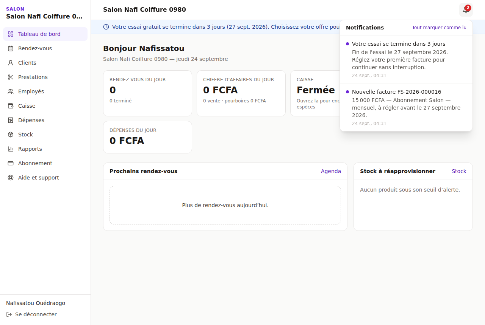
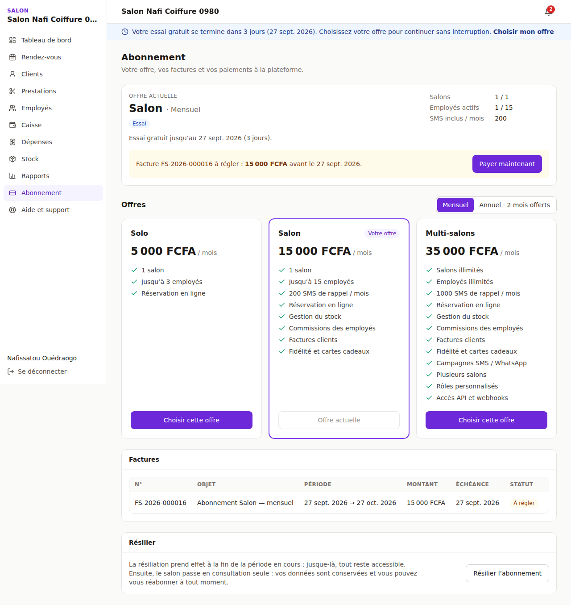
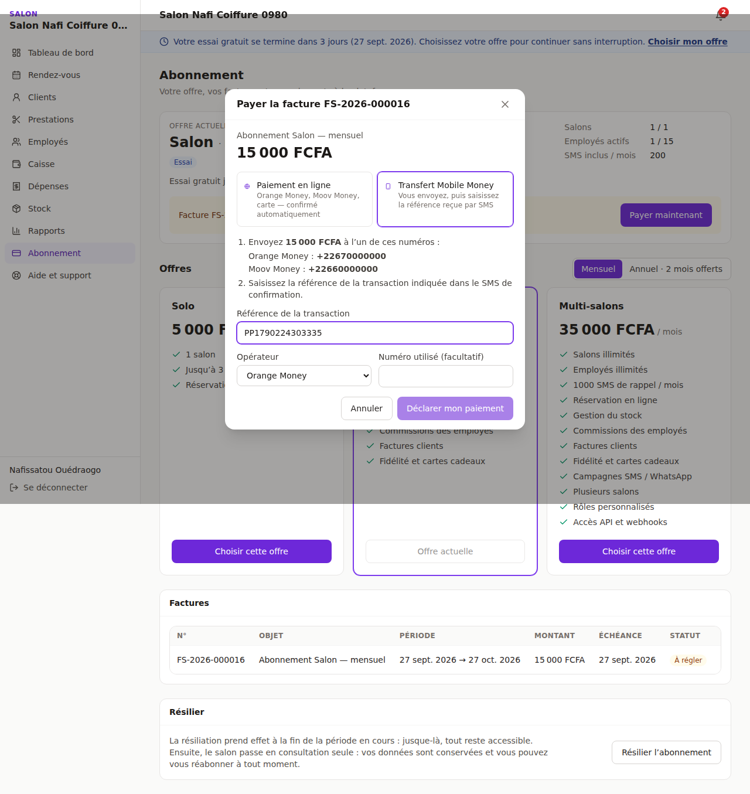
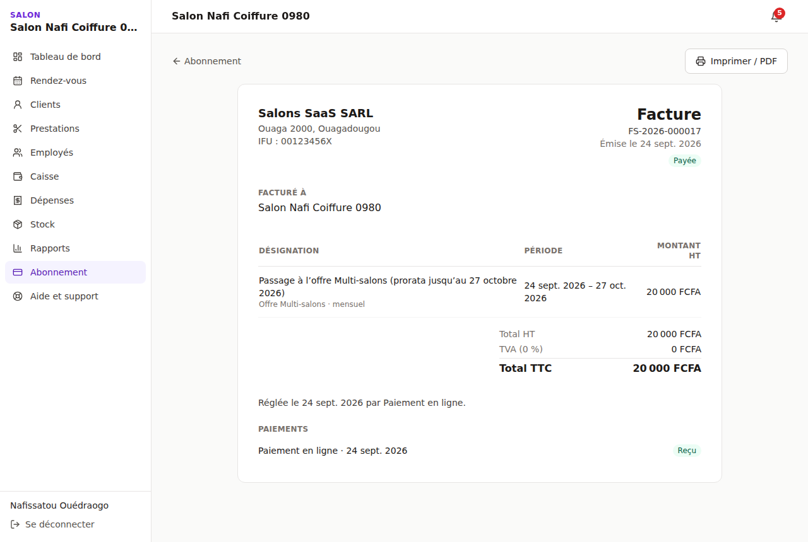
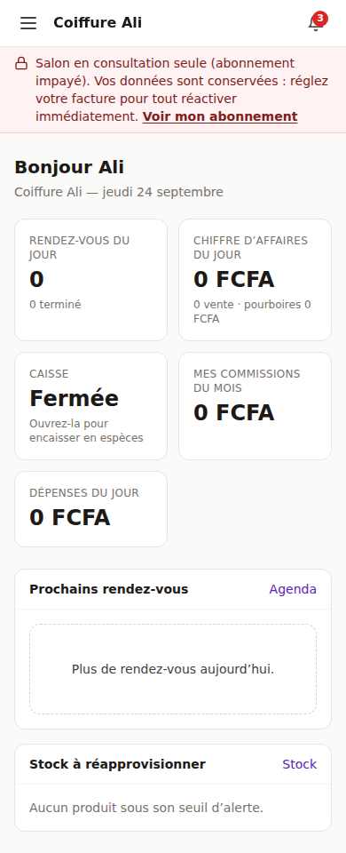
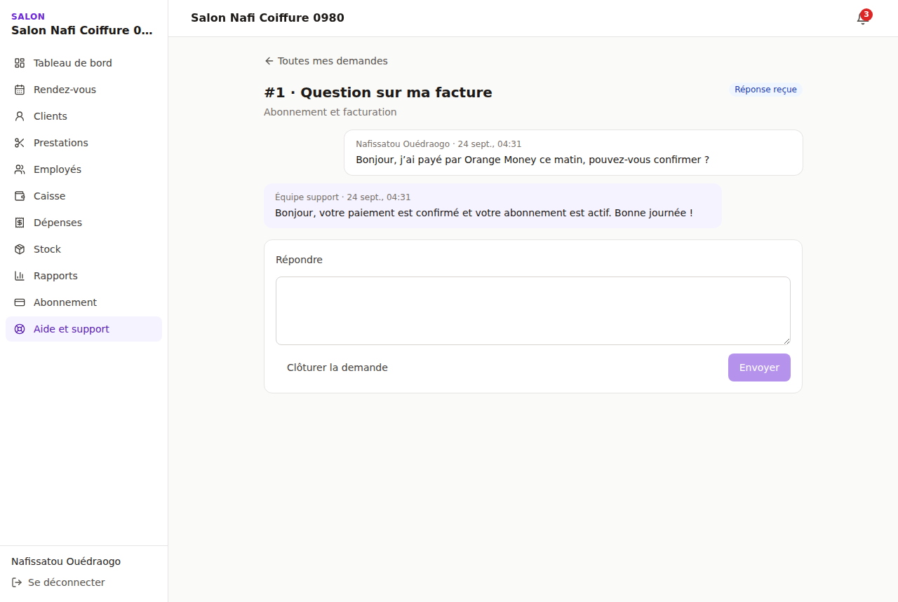

# Abonnements et facturation de la plateforme

> Code : `apps/api/src/modules/billing` (moteur, routes du salon, agrégateurs), `modules/notifications`,
> `modules/support`, pages web `/abonnement`, `/support`.
> Tests : `test/billing.e2e-spec.ts` (19 scénarios), `billing-periods.spec.ts`. Parcours complet joué
> dans Chromium : fin d'essai → paiement Mobile Money → validation par l'éditeur → passage à une offre
> supérieure payée en ligne → salon suspendu.

| Fin d'essai (bandeau + cloche) | Page Abonnement | Paiement |
|---|---|---|
|  |  |  |

| Facture imprimable | Salon suspendu (mobile) | Réponse du support |
|---|---|---|
|  |  |  |

---

## 1. Cycle de vie d'un abonnement

```
inscription ──► ESSAI (30 j, gratuit, offre Salon par défaut)
                  │  J-7 : facture de la 1re période émise ; rappels J-7, J-3, J-1 (SMS la veille)
                  ▼
échéance ──┬── facture payée ─────────────► ACTIF ── J-7 : facture suivante, rappels J-3, J-1
           │                                   ▲
           └── impayée ─► IMPAYÉ (accès complet, délai de grâce 3 j, SMS)
                            │ paiement ────────┘  (période suivante sans trou)
                            ▼ fin du délai
                         SUSPENDU (consultation seule, données conservées, SMS)
                            │ paiement → réactivé immédiatement, nouvelle période à partir du paiement
résiliation demandée ─► accès complet jusqu'à l'échéance ─► RÉSILIÉ (consultation seule, réabonnement possible)
```

| Règle | Détail |
|---|---|
| Essai | Période comme une autre, gratuite : `current_period_end` = fin d'essai. Durée et offre d'inscription réglables par le super administrateur |
| Renouvellement | Facture émise `renewalLeadDays` (7) jours avant l'échéance. **Une seule** facture de renouvellement non annulée par période (index unique partiel) : le planificateur peut repasser autant de fois qu'il veut |
| Continuité | Paiement avant ou pendant le délai de grâce : la période suivante démarre à l'échéance, sans trou ni chevauchement |
| Réactivation | Après suspension, la nouvelle période démarre **au paiement** : le salon ne paie pas le temps passé en lecture seule |
| Suspension | Lecture seule : toutes les écritures sont refusées (403 explicite), sauf session, abonnement, notifications et support (`@ReadOnlyExempt`). Aucune donnée n'est supprimée |
| Résiliation | À la fin de la période en cours ; annulable jusque-là. Ensuite : consultation seule, réabonnement en un paiement |

## 2. Changer d'offre

| Situation | Effet |
|---|---|
| Pendant l'essai | Immédiat. L'essai continue ; la facture de la première période est refaite au nouveau prix |
| Offre supérieure, même cycle | Facture de la **différence au prorata** du temps restant (arrondie à la dizaine), à régler sous 3 jours ; l'offre s'active au paiement. La facture de renouvellement déjà émise est refaite |
| Offre inférieure ou changement de cycle | Programmé pour le renouvellement ; affiché sur la page Abonnement |
| Salon suspendu ou résilié | Nouvelle facture ; le salon est réactivé dès son paiement |
| Utilisation supérieure aux limites de l'offre visée | Refusé avec un message clair (« L'offre Salon est limitée à 1 salon : vous en avez 2 ») |

Quand les fonctionnalités changent, la version des permissions des membres est incrémentée : leurs
jetons sont renouvelés automatiquement et le menu s'adapte (par exemple, « Stock » disparaît en Solo).

## 3. Paiement

### Mobile Money manuel (disponible partout, sans contrat)
1. Le salon envoie le montant à l'un des numéros de l'éditeur (affichés sur la page de paiement).
2. Il saisit la référence reçue par SMS. Elle est unique : la même référence ne peut pas servir deux fois,
   même par un autre salon.
3. L'équipe facturation la retrouve sur son relevé et valide (ou rejette avec un motif) dans la console.
   La validation réactive le salon immédiatement et le notifie.

### Paiement en ligne (CinetPay : Orange Money, Moov Money, cartes)
- Le salon est redirigé vers la page de paiement de l'agrégateur, puis revient sur `/abonnement/retour`.
- **La confirmation ne repose jamais sur le contenu reçu** : à la notification de l'agrégateur
  (`POST /billing/webhooks/cinetpay`) comme au retour du salon, l'API interroge l'agrégateur, puis contrôle
  montant et devise avant de régler la facture. Un montant différent est refusé et tracé.
- Idempotent : une notification rejouée n'a aucun effet.
- `PAYMENT_PROVIDER=sandbox` remplace CinetPay par un simulateur (page `/abonnement/paiement-test`) pour
  tester tout le parcours ; il est refusé au démarrage en production.

> Le connecteur CinetPay reprend celui de la plateforme laverie. Il n'a pas été testé contre l'API réelle
> (compte marchand requis) : à valider en recette avant l'ouverture.

## 4. Factures

- Numérotation continue de l'éditeur : `FS-2026-000001` (table `platform_sequences`, verrouillée pendant
  l'émission).
- Identité de l'acheteur (raison sociale, IFU, RCCM) **figée** à l'émission ; vendeur = paramètres de
  l'éditeur.
- Montants contrôlés par PostgreSQL (`total = sous-total + TVA`, période cohérente, paiement > 0).
- Page imprimable `/abonnement/factures/[id]` (Imprimer → PDF).
- TVA : 0 % par défaut, réglable (nouvelles factures uniquement). **À confirmer avec votre comptable.**

## 5. Notifications

| Événement | Application | SMS |
|---|---|---|
| Essai : fin dans 7 / 3 / 1 jour(s) | ✓ | veille |
| Nouvelle facture | ✓ | |
| Facture à régler dans 3 / 1 jour(s) | ✓ | veille |
| Échéance dépassée (impayé) | ✓ | ✓ |
| Salon suspendu | ✓ | ✓ |
| Paiement reçu, paiement refusé | ✓ | reçu |
| Salon réactivé, offre changée, résiliation | ✓ | résiliation effective |
| Réponse du support | ✓ (au demandeur) | |

- Destinataires : propriétaires et membres ayant `billing.manage` (le support notifie le demandeur).
- **Jamais deux fois la même alerte** : clé d'unicité `(tenant_id, dedupe_key)`.
- Cloche dans l'en-tête (non lues, tout marquer comme lu, lien vers l'écran concerné) ; bandeau d'état
  en haut de chaque écran (fin d'essai, impayé, lecture seule), avec icône et texte, jamais la couleur seule.
- SMS envoyés par `MessagingService` (journal en développement ; brancher le fournisseur SMS/WhatsApp).

## 6. Planificateur

- Toutes les `BILLING_TICK_SECONDS` (300 s), dans l'API : factures, rappels, impayés, suspensions,
  résiliations.
- Verrou consultatif PostgreSQL : une seule passe à la fois, même avec plusieurs instances.
- Chaque abonnement est traité dans sa propre transaction, ligne verrouillée (`FOR UPDATE`) : planificateur,
  notifications de paiement et actions de la console ne peuvent pas se marcher dessus.
- Rattrapage manuel : console → Abonnements → « Lancer la facturation maintenant ».
- `BILLING_SCHEDULER=off` pour les tests.

## 7. Sécurité et isolation

| Mesure | Détail |
|---|---|
| Deux connexions | Le salon lit ses factures et paiements par la connexion de l'API (RLS). Le moteur et la console utilisent `salons_platform` (BYPASSRLS), avec un filtre `tenant_id` explicite dans chaque requête |
| Droits PostgreSQL | L'API des salons ne peut ni créer ni modifier une facture, un paiement, la numérotation ou les paramètres de l'éditeur (`REVOKE`) |
| Permissions | Page Abonnement et paiement : `billing.manage` (propriétaire par défaut). Bandeau : tout membre |
| Isolation | Un salon ne voit, ne paie ni ne suit les factures d'un autre (tests) |
| Notes internes du support | Masquées par la politique RLS elle-même : la connexion de l'API ne peut ni les lire ni en écrire |

## 8. Routes

| Domaine | Routes |
|---|---|
| Salon | `GET /billing/status`, `GET /billing`, `GET /billing/invoices`, `GET /billing/invoices/:id`, `POST /billing/plan`, `POST /billing/cancel`, `POST /billing/resume`, `POST /billing/invoices/:id/pay`, `GET /billing/payments/:id` |
| Agrégateur | `POST /billing/webhooks/:provider` (publique, vérifiée), `POST /billing/sandbox/:transaction/complete` (hors production) |
| Notifications | `GET /notifications`, `GET /notifications/unread-count`, `POST /notifications/:id/read`, `POST /notifications/read-all` |
| Support (salon) | `GET/POST /support/tickets`, `GET /support/tickets/:id`, `POST /support/tickets/:id/messages`, `POST /support/tickets/:id/close` |

Migrations : `20260925090000_facturation_saas`, `20260926090000_super_admin`.

## 9. Correctif transversal

En testant dans le navigateur, un défaut antérieur est apparu : le client web joignait l'ancien jeton
d'accès à `POST /auth/refresh`. Après **tout** changement de droits (offre, mais aussi rôle modifié par le
propriétaire), le renouvellement échouait et le membre était déconnecté. Désormais une route publique
ignore tout jeton joint, et le client ne l'envoie plus au renouvellement (test de non-régression ajouté).

## 10. Limites et suites

| Sujet | État |
|---|---|
| CinetPay réel | Connecteur prêt, à valider avec le compte marchand |
| Facture PDF envoyée par WhatsApp / e-mail | Impression navigateur uniquement |
| Avoirs, remboursements | Un paiement en double est marqué « à rembourser » ; le remboursement se fait hors plateforme |
| Quotas SMS | Affichés par offre ; le décompte et le blocage au-delà du quota restent à brancher |
| Plusieurs devises | Tout est en FCFA (XOF) |
