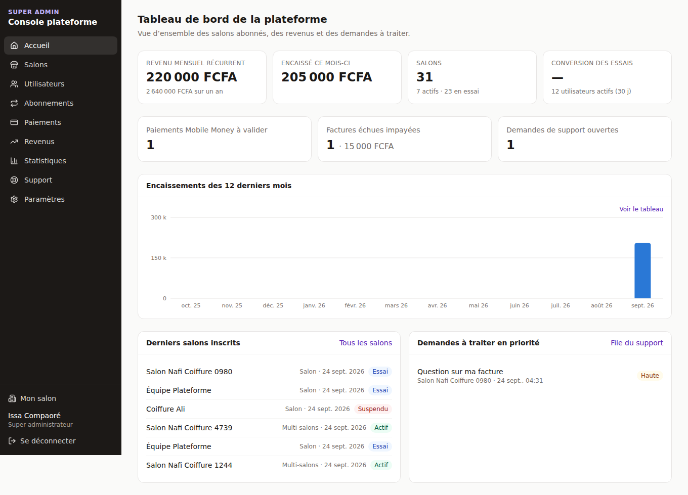
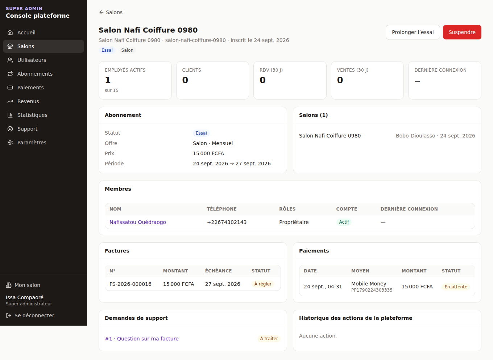
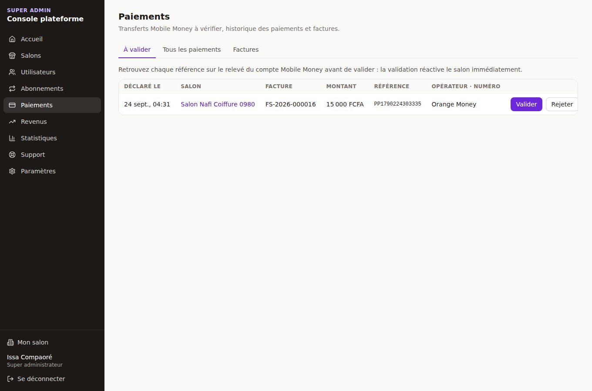
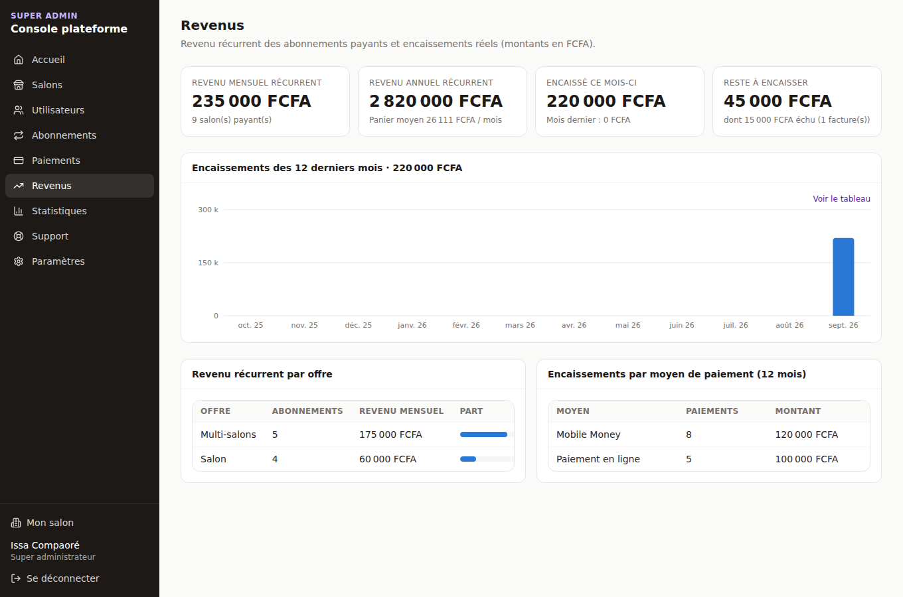
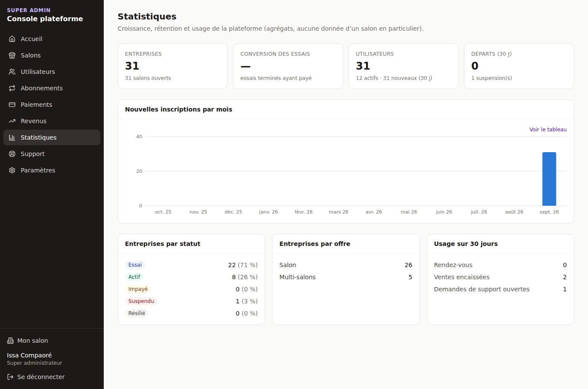
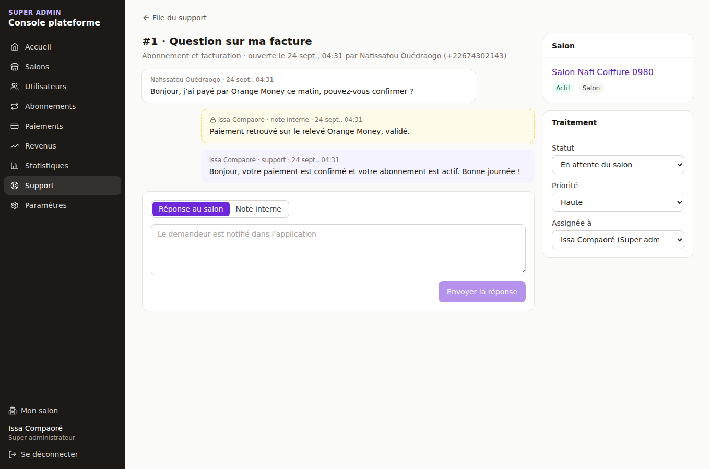
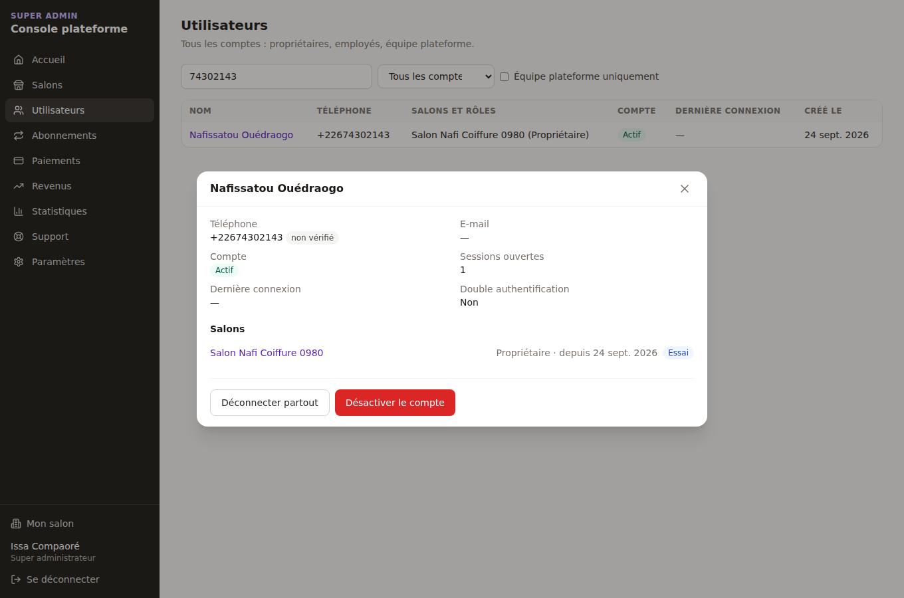
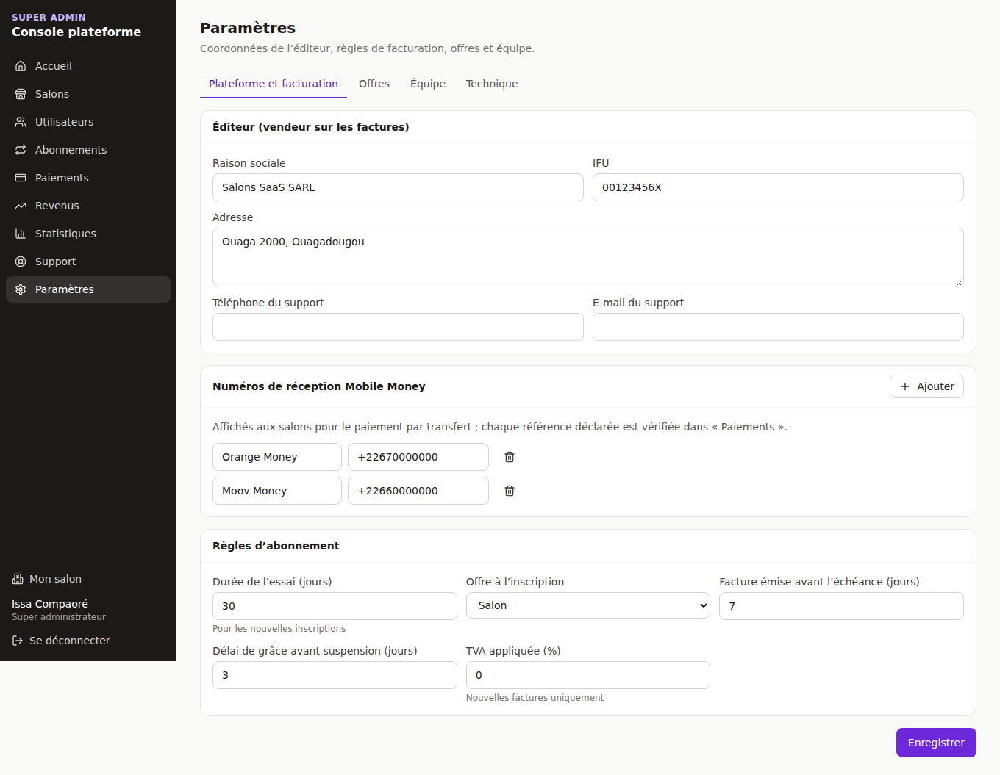

# Console super administrateur

> Code : `apps/api/src/modules/platform` (API `/api/v1/platform/*`), `apps/web/app/(plateforme)`
> (écrans `/plateforme/*`). Réservée à l'équipe de l'éditeur ; aucun salon n'y a accès.

```
SUPER ADMIN
     ├── Accueil        indicateurs clés, encaissements 12 mois, à traiter
     ├── Salons         toutes les entreprises, fiche détaillée, gestes commerciaux
     ├── Utilisateurs   tous les comptes, déverrouiller / désactiver / déconnecter
     ├── Abonnements    échéances, impayés, résiliations, facturation manuelle
     ├── Paiements      Mobile Money à valider, historique, factures
     ├── Revenus        revenu récurrent, encaissements, reste à encaisser
     ├── Statistiques   inscriptions, conversion, départs, usage
     ├── Support        file des demandes des salons, réponses, notes internes
     └── Paramètres     éditeur, Mobile Money, règles d'abonnement, offres, équipe
```

| Accueil | Fiche salon | Paiements à valider |
|---|---|---|
|  |  |  |

| Revenus | Statistiques | Support |
|---|---|---|
|  |  |  |

| Utilisateur | Paramètres |
|---|---|
|  |  |

---

## 1. Accès

### Premier super administrateur
Le compte doit exister (inscription normale par téléphone), puis :

```bash
cd apps/api
PLATFORM_DATABASE_URL=… npm run platform:grant -- +22670000000 PLATFORM_OWNER
```

Ensuite l'équipe se gère depuis la console (Paramètres → Équipe). Le lien « Console super admin »
apparaît dans le menu de l'application ; un membre de l'équipe sans salon arrive directement sur
`/plateforme`.

### Rôles de l'équipe

| Rubrique / action | Super administrateur | Facturation | Support |
|---|:---:|:---:|:---:|
| Accueil, Salons (consultation), Statistiques, Paramètres (consultation) | ✓ | ✓ | ✓ |
| Prolonger un essai | ✓ | ✓ | ✓ |
| Suspendre / réactiver un salon | ✓ | ✓ | |
| Abonnements, Paiements (valider, rejeter, annuler une facture), Revenus | ✓ | ✓ | |
| Utilisateurs (déverrouiller, désactiver, déconnecter) | ✓ | | ✓ |
| Support (répondre, notes internes, assigner) | ✓ | | ✓ |
| Modifier paramètres, offres, équipe | ✓ | | |

- Le rôle est **relu en base à chaque requête** : un accès retiré prend effet immédiatement, sans attendre
  l'expiration du jeton.
- Il doit toujours rester au moins un super administrateur ; personne ne peut désactiver son propre compte
  ni retirer son propre accès.
- **Chaque action est journalisée** (`audit_logs` : salon concerné, agent, motif) et visible dans la fiche
  du salon.

## 2. Rubriques

### Salons
Recherche par nom, identifiant ou téléphone du propriétaire ; filtres par statut et offre. La fiche
montre : identité (IFU, RCCM), abonnement, salons, membres et leurs rôles, factures, paiements, demandes
de support, historique des actions de la plateforme, et des **indicateurs d'activité** (employés,
clients, rendez-vous et ventes sur 30 jours, dernière connexion).

> Confidentialité : la console n'affiche que des volumes. Elle ne montre jamais le contenu métier d'un
> salon (fiches clients, notes, fiches techniques, détail des ventes).

Actions : prolonger l'essai (relance aussi un essai expiré jamais payé), suspendre avec un motif
communiqué au salon (application + SMS), lever la suspension (le statut est recalculé d'après
l'abonnement).

### Utilisateurs
Tous les comptes avec leurs salons et rôles. Fiche : téléphone vérifié, sessions ouvertes, échecs de
connexion, double authentification. Actions : **déverrouiller** (après trop d'échecs), **déconnecter
partout**, **désactiver** (connexion impossible, sessions fermées immédiatement) et réactiver, avec motif
obligatoire.

### Abonnements
Liste filtrable par statut et échéance (sous 7 / 30 jours), compteurs par statut, changements programmés,
fin du délai de grâce. Bouton de rattrapage « Lancer la facturation maintenant ».

### Paiements
- **À valider** : transferts Mobile Money déclarés (référence, opérateur, numéro), à rapprocher du relevé.
  Valider réactive le salon immédiatement ; rejeter le notifie avec le motif.
- **Tous les paiements** : filtres statut, moyen, période ; motif des échecs (montant falsifié, refus).
- **Factures** : ouvertes, payées, annulées ; annulation avec motif (geste commercial, erreur).

### Revenus
Revenu mensuel récurrent (abonnements ayant déjà payé, annuel ramené au mois) et annuel, panier moyen,
revenu menacé par des résiliations programmées, encaissé ce mois (et évolution), reste à encaisser dont
échu, encaissements sur 12 mois (graphique + tableau), répartition par offre et par moyen de paiement.

### Statistiques
Entreprises par statut et par offre, inscriptions par mois, **taux de conversion des essais** (essais
terminés ayant payé), départs et suspensions sur 30 jours, utilisateurs actifs et nouveaux, usage de la
plateforme (rendez-vous, ventes), demandes de support ouvertes.

### Support
Les salons écrivent depuis « Aide et support » (tout membre ; le propriétaire voit toutes les demandes
de son salon). File triée par priorité puis ancienneté ; une demande « facturation » est prioritaire
d'office. L'agent répond (le demandeur est notifié) ou ajoute une **note interne**, invisible du salon —
garanti par la politique RLS de PostgreSQL, pas seulement par l'écran. Statut, priorité, assignation.

### Paramètres
| Onglet | Contenu |
|---|---|
| Plateforme et facturation | Raison sociale, adresse, IFU (vendeur sur les factures), contacts du support, numéros Mobile Money, durée d'essai, offre à l'inscription, délai d'émission des factures, délai de grâce, TVA |
| Offres | Prix mensuel / annuel, limites (salons, employés, SMS), fonctionnalités incluses, publique ou non, active ou non. Les prix changent au prochain renouvellement des abonnés ; limites et fonctionnalités immédiatement |
| Équipe | Ajout par téléphone avec un rôle, retrait d'accès |
| Technique | Réglages du fichier `.env` affichés en lecture seule (agrégateur, planificateur, adresses) |

Les paramètres sont validés à l'écriture, stockés dans `platform_settings` (la valeur de `.env` sert
de valeur par défaut) et appliqués sans redémarrage.

## 3. Routes

Toutes sous `/api/v1/platform`, réservées à l'équipe (garde `PlatformStaffGuard` + rôle par route).

| Rubrique | Routes |
|---|---|
| Accueil | `GET /me`, `GET /home` |
| Salons | `GET /tenants`, `GET /tenants/:id`, `POST /tenants/:id/extend-trial`, `/suspend`, `/reactivate` |
| Utilisateurs | `GET /users`, `GET /users/:id`, `POST /users/:id/status`, `/unlock`, `/logout` |
| Abonnements | `GET /subscriptions`, `POST /billing/run` |
| Paiements | `GET /payments`, `GET /invoices`, `POST /payments/:id/validate`, `/reject`, `POST /invoices/:id/void` |
| Revenus, statistiques | `GET /revenue`, `GET /statistics` |
| Support | `GET /support/tickets`, `GET /support/tickets/:id`, `POST /support/tickets/:id/messages`, `PATCH /support/tickets/:id` |
| Paramètres | `GET/PATCH /settings`, `GET/POST /plans`, `PUT /plans/:id`, `GET/POST /staff`, `POST /staff/:userId/revoke` |

## 4. Suites possibles

| Sujet | Proposition |
|---|---|
| Accès délégué au salon | La table `impersonation_grants` existe : consultation d'un salon par le support, accordée et révocable par son propriétaire, en lecture seule et journalisée |
| Double authentification obligatoire pour l'équipe | Les champs TOTP existent ; à rendre obligatoire pour les rôles plateforme |
| Export comptable | Export CSV des factures et encaissements par période |
